```mermaid
graph TB
    subgraph "Multi-Cloud Infrastructure"
        subgraph "AWS Production"
            EKS[EKS Cluster]
            RDS[RDS Database]
            S3[S3 Storage]
            ALB[Application Load Balancer]
        end
        
        subgraph "Azure DR Site"
            AKS[AKS Cluster]
            ASQL[Azure SQL]
            BLOB[Blob Storage]
            APPGW[Application Gateway]
        end
        
        subgraph "GCP Development"
            GKE[GKE Cluster]
            CSQL[Cloud SQL]
            GCS[Cloud Storage]
            GLB[Global Load Balancer]
        end
    end
    
    subgraph "DevOps Pipeline"
        DEV[Developer] -->|Git Push| REPO[Repository]
        REPO --> JENKINS[Jenkins Pipeline]
        JENKINS --> BUILD[Build & Test]
        BUILD --> SECURITY[Security Scan]
        SECURITY --> REGISTRY[Container Registry]
        REGISTRY --> ARGOCD[ArgoCD GitOps]
        ARGOCD --> DEPLOY[Multi-Environment Deploy]
    end
    
    subgraph "Observability Stack"
        PROM[Prometheus]
        GRAF[Grafana]
        ELK[ELK Stack]
        JAEGER[Jaeger Tracing]
    end
    
    EKS --> PROM
    AKS --> PROM
    GKE --> PROM
    PROM --> GRAF
    
    style EKS fill:#ff9900
    style AKS fill:#0078d4
    style GKE fill:#4285f4
    style JENKINS fill:#d33833
    style ARGOCD fill:#ef7b4d
```
  

  

  
  
  
  
  

 

<h2 align="center" style="color: white; margin: 0; font-size: 28px; text-shadow: 2px 2px 4px rgba(0,0,0,0.3);"><svg width="30" height="30" viewBox="0 0 24 24" fill="white"><path d="M12 2C13.1 2 14 2.9 14 4C14 5.1 13.1 6 12 6C10.9 6 10 5.1 10 4C10 2.9 10.9 2 12 2ZM21 9V7L15 1.5V6H9V1.5L3 7V9H21ZM12 8C14.8 8 17 10.2 17 13C17 15.8 14.8 18 12 18C9.2 18 7 15.8 7 13C7 10.2 9.2 8 12 8Z"/></svg> Professional Profile</h2>

<table>
<tr>
<td width="65%">

### <svg width="24" height="24" viewBox="0 0 24 24" fill="white"><path d="M12 2C6.48 2 2 6.48 2 12s4.48 10 10 10 10-4.48 10-10S17.52 2 12 2zm-2 15l-5-5 1.41-1.41L10 14.17l7.59-7.59L19 8l-9 9z"/></svg> **Professional Summary**
**DevOps Engineer** hands-on experience in **AWS cloud infrastructure**, **Linux system administration**, and **CI/CD pipeline development**. Passionate about automation, infrastructure as code, and continuous learning. Strong foundation in **containerization**, **monitoring**, and **DevOps best practices** with a focus on delivering reliable and scalable solutions.

### <svg width="24" height="24" viewBox="0 0 24 24" fill="white"><path d="M12 2l3.09 6.26L22 9.27l-5 4.87 1.18 6.88L12 17.77l-6.18 3.25L7 14.14 2 9.27l6.91-1.01L12 2z"/></svg> **Core Strengths**
*Building robust cloud infrastructure, automating deployment processes, and maintaining high-availability systems while continuously expanding technical expertise in modern DevOps practices.*

### <svg width="24" height="24" viewBox="0 0 24 24" fill="white"><path d="M9 12l2 2 4-4m6 2a9 9 0 11-18 0 9 9 0 0118 0z"/></svg> **Key Achievements**
 
 

</td>
<td width="35%">

  
    
  

</td>
</tr>
</table>

<h2 align="center" style="color: white; margin: 0; font-size: 28px; text-shadow: 2px 2px 4px rgba(0,0,0,0.3);"><svg width="30" height="30" viewBox="0 0 24 24" fill="white"><path d="M12 2l3.09 6.26L22 9.27l-5 4.87 1.18 6.88L12 17.77l-6.18 3.25L7 14.14 2 9.27l6.91-1.01L12 2z"/></svg> DevOps Technology Stack & Skills</h2>

### <svg width="30" height="30" viewBox="0 0 24 24" fill="white"><path d="M19.35 10.04C18.67 6.59 15.64 4 12 4 9.11 4 6.6 5.64 5.35 8.04 2.34 8.36 0 10.91 0 14c0 3.31 2.69 6 6 6h13c2.76 0 5-2.24 5-5 0-2.64-2.05-4.78-4.65-4.96z"/></svg> **AWS Cloud Platform (Primary Focus)**

### <svg width="30" height="30" viewBox="0 0 24 24" fill="white"><path d="M22 12c0-5.52-4.48-10-10-10S2 6.48 2 12s4.48 10 10 10 10-4.48 10-10zm-7-3l-4 4-2-2-1.5 1.5L11 16l5.5-5.5L15 9z"/></svg> **Linux System Administration**

### <svg width="30" height="30" viewBox="0 0 24 24" fill="white"><path d="M13.5 2c-5.621 0-10.211 4.443-10.475 10H3c-.552 0-1 .449-1 1 0 .551.448 1 1 1h.025C3.289 19.557 7.879 24 13.5 24 19.403 24 24 19.403 24 13.5S19.403 2 13.5 2z"/></svg> **Containerization & Orchestration**

### <svg width="30" height="30" viewBox="0 0 24 24" fill="white"><path d="M11.5 2L13 8l6-5-4 7h4l-8 10v-6l-4-.002L11.5 2z"/></svg> **CI/CD & Automation Tools**

### <svg width="30" height="30" viewBox="0 0 24 24" fill="white"><path d="M12 2L2 7v10c0 5.55 3.84 9.74 9 11 5.16-1.26 9-5.45 9-11V7l-10-5z"/></svg> **Infrastructure as Code**

### <svg width="30" height="30" viewBox="0 0 24 24" fill="white"><path d="M3 13h8V3H3v10zm0 8h8v-6H3v6zm10 0h8V11h-8v10zm0-18v6h8V3h-8z"/></svg> **Monitoring & Observability**

### <svg width="30" height="30" viewBox="0 0 24 24" fill="white"><path d="M9.4 16.6L4.8 12l4.6-4.6L8 6l-6 6 6 6 1.4-1.4zm5.2 0L19.2 12l-4.6-4.6L16 6l6 6-6 6-1.4-1.4z"/></svg> **Programming & Scripting**

<h2 align="center" style="color: white; margin: 0; font-size: 28px;"> Current Projects & Achievements</h2>

### **Infrastructure Modernization**
<table width="100%">
<tr>
<td width="50%">
<strong>Cloud Migration Excellence</strong> 

 Successfully migrated microservices to cloud-native architecture using Kubernetes on AWS EKS, Azure AKS, and GCP GKE.
</td>
<td width="50%">
<strong>Cost Optimization</strong> 

 Achieved 45% cost reduction through intelligent resource right-sizing, auto-scaling, and reserved instance optimization.
</td>
</tr>
</table>

###  **DevOps Transformation**
<table width="100%">
<tr>
<td width="50%">
<strong>CI/CD Pipeline Excellence</strong> 

 Built enterprise-grade CI/CD pipelines reducing deployment time from hours to minutes with automated testing and rollback capabilities.
</td>
<td width="50%">
<strong>GitOps Implementation</strong> 

 Implemented GitOps workflows with ArgoCD for seamless application deployments and automated rollback mechanisms.
</td>
</tr>
</table>

### **Security & Compliance**
<table width="100%">
<tr>
<td width="50%">
<strong>Zero-Trust Architecture</strong> 

 Implemented comprehensive security frameworks including service mesh, network policies, and secret management.
</td>
<td width="50%">
<strong>Monitoring & Observability</strong> 

 Deployed comprehensive observability stack with Prometheus, Grafana, and distributed tracing for proactive monitoring.
</td>
</tr>
</table>

<h2 align="center" style="color: white; margin: 0; font-size: 28px;"><svg width="30" height="30" viewBox="0 0 24 24" fill="white"><path d="M12 2l3.09 6.26L22 9.27l-5 4.87 1.18 6.88L12 17.77l-6.18 3.25L7 14.14 2 9.27l6.91-1.01L12 2z"/></svg> Enterprise Architecture & Cloud Solutions</h2>

### <svg width="24" height="24" viewBox="0 0 24 24" fill="#0080FF"><path d="M19.35 10.04C18.67 6.59 15.64 4 12 4 9.11 4 6.6 5.64 5.35 8.04 2.34 8.36 0 10.91 0 14c0 3.31 2.69 6 6 6h13c2.76 0 5-2.24 5-5 0-2.64-2.05-4.78-4.65-4.96z"/></svg> **Multi-Cloud Architecture Strategy**

### <svg width="24" height="24" viewBox="0 0 24 24" fill="#0080FF"><path d="M12 2C6.48 2 2 6.48 2 12s4.48 10 10 10 10-4.48 10-10S17.52 2 12 2zm-2 15l-5-5 1.41-1.41L10 14.17l7.59-7.59L19 8l-9 9z"/></svg> **Enterprise Solutions Portfolio**

<table width="100%">
<tr>
<td width="33%" align="center">
<strong>Infrastructure as Code</strong> 

 Automated infrastructure provisioning across multi-cloud environments with version control and compliance.
</td>
<td width="33%" align="center">
<strong>Container Orchestration</strong> 

 Scalable container management with service mesh, auto-scaling, and zero-downtime deployments.
</td>
<td width="33%" align="center">
<strong>Security & Compliance</strong> 

 End-to-end security implementation with policy enforcement and continuous compliance monitoring.
</td>
</tr>
</table>

---

<h2 align="center" style="color: white; margin: 0; font-size: 28px;"><svg width="30" height="30" viewBox="0 0 24 24" fill="white"><path d="M12 2l3.09 6.26L22 9.27l-5 4.87 1.18 6.88L12 17.77l-6.18 3.25L7 14.14 2 9.27l6.91-1.01L12 2z"/></svg> Professional Network & Contact</h2>

<table>
<tr>
<td align="center" width="25%">
  <svg width="48" height="48" viewBox="0 0 24 24" fill="#0077B5"><path d="M20.447 20.452h-3.554v-5.569c0-1.328-.027-3.037-1.852-3.037-1.853 0-2.136 1.445-2.136 2.939v5.667H9.351V9h3.414v1.561h.046c.477-.9 1.637-1.85 3.37-1.85 3.601 0 4.267 2.37 4.267 5.455v6.286zM5.337 7.433c-1.144 0-2.063-.926-2.063-2.065 0-1.138.92-2.063 2.063-2.063 1.14 0 2.064.925 2.064 2.063 0 1.139-.925 2.065-2.064 2.065zm1.782 13.019H3.555V9h3.564v11.452zM22.225 0H1.771C.792 0 0 .774 0 1.729v20.542C0 23.227.792 24 1.771 24h20.451C23.2 24 24 23.227 24 22.271V1.729C24 .774 23.2 0 22.222 0h.003z"/></svg> 
  
</td>
<td align="center" width="25%">
  <svg width="48" height="48" viewBox="0 0 24 24" fill="#181717"><path d="M12 0c-6.626 0-12 5.373-12 12 0 5.302 3.438 9.8 8.207 11.387.599.111.793-.261.793-.577v-2.234c-3.338.726-4.033-1.416-4.033-1.416-.546-1.387-1.333-1.756-1.333-1.756-1.089-.745.083-.729.083-.729 1.205.084 1.839 1.237 1.839 1.237 1.07 1.834 2.807 1.304 3.492.997.107-.775.418-1.305.762-1.604-2.665-.305-5.467-1.334-5.467-5.931 0-1.311.469-2.381 1.236-3.221-.124-.303-.535-1.524.117-3.176 0 0 1.008-.322 3.301 1.23.957-.266 1.983-.399 3.003-.404 1.02.005 2.047.138 3.006.404 2.291-1.552 3.297-1.23 3.297-1.23.653 1.653.242 2.874.118 3.176.77.84 1.235 1.911 1.235 3.221 0 4.609-2.807 5.624-5.479 5.921.43.372.823 1.102.823 2.222v3.293c0 .319.192.694.801.576 4.765-1.589 8.199-6.086 8.199-11.386 0-6.627-5.373-12-12-12z"/></svg> 
  
</td>
<td align="center" width="25%">
  <svg width="48" height="48" viewBox="0 0 24 24" fill="#D14836"><path d="M24 5.457v13.909c0 .904-.732 1.636-1.636 1.636h-3.819V11.73L12 16.64l-6.545-4.91v9.273H1.636A1.636 1.636 0 0 1 0 19.366V5.457c0-.887.732-1.636 1.636-1.636h.727L12 10.454l9.637-6.633h.727c.904 0 1.636.749 1.636 1.636z"/></svg> 
  
</td>
<td align="center" width="25%">
  <svg width="48" height="48" viewBox="0 0 24 24" fill="#4CAF50"><path d="M14 2H6a2 2 0 0 0-2 2v16a2 2 0 0 0 2 2h12a2 2 0 0 0 2-2V8l-6-6z"/><path d="M14 2v6h6V3h-8z"/><path d="M16 13H8"/><path d="M16 17H8"/><path d="M10 9H8"/></svg> 
  
</td>
</tr>
</table>

### <svg width="30" height="30" viewBox="0 0 24 24" fill="#FF6B35"><path d="M12 2l3.09 6.26L22 9.27l-5 4.87 1.18 6.88L12 17.77l-6.18 3.25L7 14.14 2 9.27l6.91-1.01L12 2z"/></svg> **I'm Actively Seeking**

  

<strong>🎯 What I Bring:</strong> Passionate DevOps engineer eager to contribute, learn, and grow with an innovative team. Ready to tackle challenges in cloud infrastructure, automation, and system reliability.

---

  

**"Passionate about automating the future, one pipeline at a time"**

<strong>Last updated:</strong> June 2025 | <strong>Built with passion by:</strong> Khaled Hawil | <strong>Status:</strong> Actively Growing & Learning

