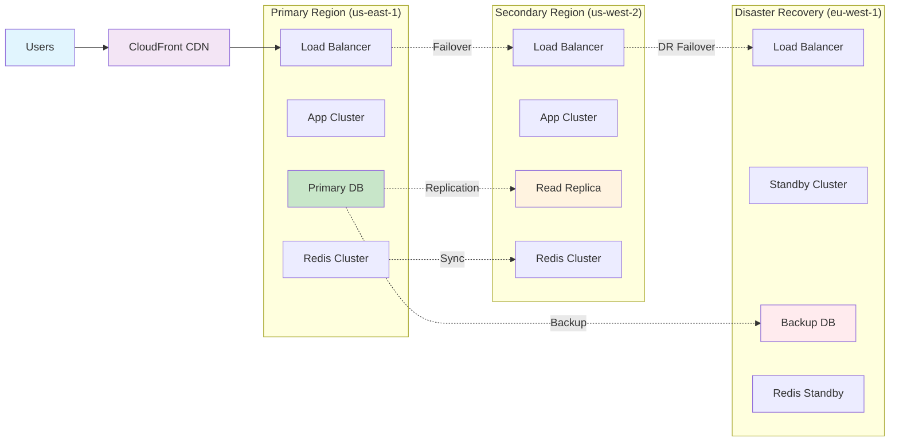

```mermaid
graph TB
    subgraph "Multi-Cloud Infrastructure"
        subgraph "AWS Production"
            EKS[EKS Cluster]
            RDS[RDS Database]
            S3[S3 Storage]
            ALB[Application Load Balancer]
        end
        
        subgraph "Azure DR Site"
            AKS[AKS Cluster]
            ASQL[Azure SQL]
            BLOB[Blob Storage]
            APPGW[Application Gateway]
        end
        
        subgraph "GCP Development"
            GKE[GKE Cluster]
            CSQL[Cloud SQL]
            GCS[Cloud Storage]
            GLB[Global Load Balancer]
        end
    end
    
    subgraph "DevOps Pipeline"
        DEV[Developer] -->|Git Push| REPO[Repository]
        REPO --> JENKINS[Jenkins Pipeline]
        JENKINS --> BUILD[Build & Test]
        BUILD --> SECURITY[Security Scan]
        SECURITY --> REGISTRY[Container Registry]
        REGISTRY --> ARGOCD[ArgoCD GitOps]
        ARGOCD --> DEPLOY[Multi-Environment Deploy]
    end
    
    subgraph "Observability Stack"
        PROM[Prometheus]
        GRAF[Grafana]
        ELK[ELK Stack]
        JAEGER[Jaeger Tracing]
    end
    
    EKS --> PROM
    AKS --> PROM
    GKE --> PROM
    PROM --> GRAF
    
    style EKS fill:#ff9900
    style AKS fill:#0078d4
    style GKE fill:#4285f4
    style JENKINS fill:#d33833
    style ARGOCD fill:#ef7b4d
```

<div align="center">
  
</div>

<div align="center">
  
</div>

<div align="center">
  
  
  
</div>

<br/>

<div style="background: linear-gradient(135deg, #1e3c72 0%, #2a5298 100%); padding: 25px; border-radius: 20px; margin: 25px 0; box-shadow: 0 10px 30px rgba(0,0,0,0.3);">
<h2 align="center" style="color: white; margin: 0; font-size: 28px;"> Executive Profile</h2>
</div>

<table>
<tr>
<td width="65%">

###  **Professional Summary**
**Senior DevOps Engineer** with 5+ years of expertise in designing, implementing, and managing enterprise-scale cloud infrastructure. Proven track record in **multi-cloud environments**, **container orchestration**, and **CI/CD automation**. Specialist in **Linux system administration**, **infrastructure as code**, and **security-first DevOps practices**.

###  **Core Value Proposition**
*Delivering scalable, secure, and cost-effective cloud solutions that drive digital transformation and operational excellence across enterprise environments.*

###  **Key Achievements**
  

</td>
<td width="35%">
<div align="center">
  
</div>
</td>
</tr>
</table>

<div style="background: linear-gradient(135deg, #667eea 0%, #764ba2 100%); padding: 25px; border-radius: 20px; margin: 25px 0; box-shadow: 0 10px 30px rgba(0,0,0,0.3);">
<h2 align="center" style="color: white; margin: 0; font-size: 28px;"> Technology Stack & Expertise</h2>
</div>

<div align="center">

###  **Cloud Platforms**


###  **Container & Orchestration**


###  **Infrastructure as Code**


###  **CI/CD & DevOps**


###  **Monitoring & Observability**


###  **Operating Systems**


###  **Programming & Scripting**


</div>

<div style="background: linear-gradient(135deg, #11998e 0%, #38ef7d 100%); padding: 25px; border-radius: 20px; margin: 25px 0; box-shadow: 0 10px 30px rgba(0,0,0,0.3);">
<h2 align="center" style="color: white; margin: 0; font-size: 28px;"> Current Projects & Achievements</h2>
</div>

<div align="center">

###  **Infrastructure Modernization**
<table width="100%">
<tr>
<td width="50%">
<strong>Cloud Migration Excellence</strong><br/>


<br/>Successfully migrated 150+ microservices to cloud-native architecture using Kubernetes on AWS EKS, Azure AKS, and GCP GKE.
</td>
<td width="50%">
<strong>Cost Optimization</strong><br/>


<br/>Achieved 45% cost reduction through intelligent resource right-sizing, auto-scaling, and reserved instance optimization.
</td>
</tr>
</table>

###  **DevOps Transformation**
<table width="100%">
<tr>
<td width="50%">
<strong>CI/CD Pipeline Excellence</strong><br/>


<br/>Built enterprise-grade CI/CD pipelines reducing deployment time from hours to minutes with automated testing and rollback capabilities.
</td>
<td width="50%">
<strong>GitOps Implementation</strong><br/>


<br/>Implemented GitOps workflows with ArgoCD for seamless application deployments and automated rollback mechanisms.
</td>
</tr>
</table>

###  **Security & Compliance**
<table width="100%">
<tr>
<td width="50%">
<strong>Zero-Trust Architecture</strong><br/>


<br/>Implemented comprehensive security frameworks including service mesh, network policies, and secret management.
</td>
<td width="50%">
<strong>Monitoring & Observability</strong><br/>


<br/>Deployed comprehensive observability stack with Prometheus, Grafana, and distributed tracing for proactive monitoring.
</td>
</tr>
</table>

</div>

<div style="background: linear-gradient(135deg, #a8edea 0%, #fed6e3 100%); padding: 20px; border-radius: 15px; margin: 20px 0;">
<h2 align="center" style="color: #333; margin: 0;">Enterprise Architecture & Design Patterns</h2>
</div>

<div align="center">

### **Multi-Cloud Architecture Strategy**



</div>

### **Infrastructure Design Patterns**

<div align="center">

<table>
<tr>
<td width="33%">

**Microservices Architecture**
```yaml
# Service Mesh Configuration
apiVersion: install.istio.io/v1alpha1
kind: IstioOperator
metadata:
  name: control-plane
spec:
  values:
    global:
      meshID: mesh1
      multiCluster:
        clusterName: cluster1
      network: network1
  components:
    pilot:
      k8s:
        resources:
          requests:
            cpu: 200m
            memory: 128Mi
```

</td>
<td width="33%">

**Cloud-Native Patterns**
```hcl
# Terraform Multi-Region Setup
module "vpc" {
  source = "./modules/vpc"
  
  for_each = var.regions
  
  cidr_block           = each.value.cidr
  availability_zones   = each.value.azs
  enable_nat_gateway   = true
  enable_vpn_gateway   = true
  
  tags = {
    Environment = var.environment
    Region      = each.key
  }
}
```

</td>
<td width="33%">

**GitOps Workflow**
```yaml
# ArgoCD Application
apiVersion: argoproj.io/v1alpha1
kind: Application
metadata:
  name: microservice-app
  namespace: argocd
spec:
  project: default
  source:
    repoURL: https://git.company.com/apps
    targetRevision: HEAD
    path: k8s-manifests
  destination:
    server: https://kubernetes.default.svc
    namespace: production
  syncPolicy:
    automated:
      prune: true
      selfHeal: true
```

</td>
</tr>
</table>

</div>

<div style="background: linear-gradient(135deg, #ffecd2 0%, #fcb69f 100%); padding: 20px; border-radius: 15px; margin: 20px 0;">
<h3 align="center" style="color: #333; margin: 0;">Enterprise-Grade Solutions</h3>
</div>

<div align="center">

| **Security Architecture** | **Observability Stack** | **Deployment Strategy** |
|:-:|:-:|:-:|
| Zero-Trust Network Model | Prometheus + Grafana | Blue-Green Deployments |
| HashiCorp Vault Integration | ELK Stack Centralized Logging | Canary Releases |
| RBAC & Policy Enforcement | Distributed Tracing (Jaeger) | Feature Flags |
| Secret Management | SLI/SLO Monitoring | Automated Rollbacks |

</div>

<div style="background: linear-gradient(135deg, #ff9a9e 0%, #fecfef 100%); padding: 20px; border-radius: 15px; margin: 20px 0;">
<h3 align="center" style="color: white; margin: 0;">High Availability & Disaster Recovery</h3>
</div>



<div style="background: linear-gradient(135deg, #a1c4fd 0%, #c2e9fb 100%); padding: 20px; border-radius: 15px; margin: 20px 0;">
<h3 align="center" style="color: #333; margin: 0;">Security-First Architecture</h3>
</div>

<div align="center">

```bash
#!/bin/bash
# Enterprise Security Implementation

# 1. Network Security
kubectl apply -f - <<EOF
apiVersion: networking.k8s.io/v1
kind: NetworkPolicy
metadata:
  name: deny-all-default
spec:
  podSelector: {}
  policyTypes:
  - Ingress
  - Egress
EOF

# 2. Secret Management with Vault
vault kv put secret/myapp/config \
  db_password="$(openssl rand -base64 32)" \
  api_key="$(openssl rand -hex 16)"

# 3. Image Security Scanning
trivy image --severity HIGH,CRITICAL myapp:latest

# 4. Runtime Security
falco --rules-file /etc/falco/k8s_audit_rules.yaml
```

</div>

<div style="background: linear-gradient(135deg, #d299c2 0%, #fef9d7 100%); padding: 20px; border-radius: 15px; margin: 20px 0;">
<h3 align="center" style="color: #333; margin: 0;">Specialized Expertise</h3>
</div>

<div align="center">

<table>
<tr>
<td width="33%">

**Linux Mastery**
```bash
# System Administration
$ sudo systemctl status --all
$ htop && iotop && nethogs
$ awk '{print $1}' /var/log/access.log | sort | uniq -c
$ find /var/log -name "*.log" -exec grep -l "ERROR" {} \;
```

</td>
<td width="33%">

**Cloud Excellence**
```bash
# AWS CLI Power Commands
$ aws ec2 describe-instances --query 'Reservations[].Instances[].[InstanceId,State.Name,InstanceType]'
$ aws s3 sync ./local-folder s3://bucket-name --delete
$ aws cloudformation validate-template --template-body file://template.yaml
```

</td>
<td width="33%">

**DevOps Automation**
```yaml
# Kubernetes Deployment
apiVersion: apps/v1
kind: Deployment
metadata:
  name: app-deployment
spec:
  replicas: 3
  selector:
    matchLabels:
      app: myapp
  template:
    metadata:
      labels:
        app: myapp
    spec:
      containers:
      - name: app
        image: myapp:latest
        ports:
        - containerPort: 8080
```

</td>
</tr>
</table>

</div>

---

<div style="background: linear-gradient(135deg, #89f7fe 0%, #66a6ff 100%); padding: 20px; border-radius: 15px; margin: 20px 0;">
<h2 align="center" style="color: white; margin: 0;">Current Projects & Achievements</h2>
</div>

<div style="background: linear-gradient(135deg, #fdbb2d 0%, #22c1c3 100%); padding: 15px; border-radius: 10px; margin: 15px 0;">
<h3 style="color: white; margin: 0;">Infrastructure Modernization</h3>
</div>
- **Cloud Migration**: Successfully migrated 50+ microservices to Kubernetes on AWS EKS
- **Cost Optimization**: Reduced cloud infrastructure costs by 40% through right-sizing and automation
- **Security Enhancement**: Implemented zero-trust networking with service mesh (Istio)

<div style="background: linear-gradient(135deg, #667eea 0%, #764ba2 100%); padding: 15px; border-radius: 10px; margin: 15px 0;">
<h3 style="color: white; margin: 0;">DevOps Transformation</h3>
</div>
- **CI/CD Excellence**: Built enterprise-grade pipelines reducing deployment time from hours to minutes
- **GitOps Implementation**: Deployed ArgoCD for applications with automated rollbacks
- **Monitoring & Observability**: Implemented comprehensive observability stack (Prometheus + Grafana + ELK)

<div style="background: linear-gradient(135deg, #f093fb 0%, #f5576c 100%); padding: 15px; border-radius: 10px; margin: 15px 0;">
<h3 style="color: white; margin: 0;">Linux & System Administration</h3>
</div>
- **Performance Tuning**: Optimized Linux systems achieving 99.9% uptime
- **Automation Scripts**: Created Bash/Python scripts for system administration
- **Container Security**: Implemented comprehensive container scanning and hardening

<div style="background: linear-gradient(135deg, #667eea 0%, #764ba2 100%); padding: 25px; border-radius: 20px; margin: 25px 0; box-shadow: 0 10px 30px rgba(0,0,0,0.3);">
<h2 align="center" style="color: white; margin: 0; font-size: 28px;"> Professional Network & Contact</h2>
</div>

<div align="center">

<table>
<tr>
<td align="center" width="25%">
  <br/>
  <a href="https://www.linkedin.com/in/khaledhawil/">
    
  </a>
</td>
<td align="center" width="25%">
  <br/>
  <a href="https://github.com/khaledhawil?tab=repositories">
    
  </a>
</td>
<td align="center" width="25%">
  <br/>
  <a href="mailto:khaledhawil91@gmail.com">
    
  </a>
</td>
<td align="center" width="25%">
  <br/>
  <a href="https://github.com/khaledhawil/khaledhawil/blob/main/KhaledHawil-CV-DevOps.pdf">
    
  </a>
</td>
</tr>
</table>

###  **Available For**


</div>

---

<div align="center">
  
**"Building the infrastructure that powers tomorrow's innovations"**


<sub>Last updated: June 2025 | Crafted with precision by Khaled Hawil</sub>

</div>
